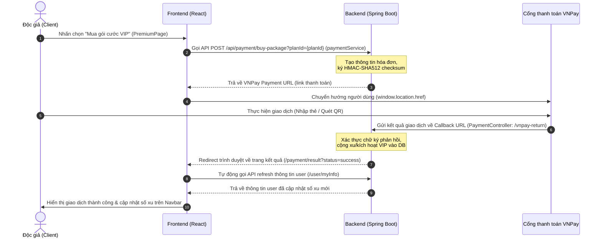
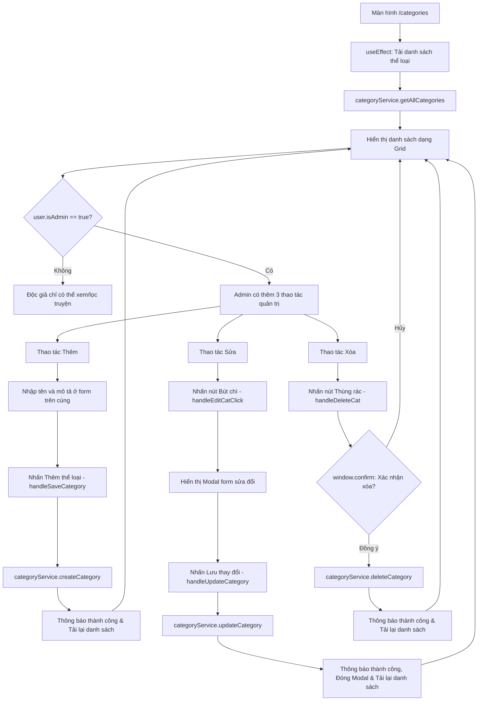

# Tài Liệu Cấu Trúc Mã Nguồn Frontend - LV Read Book

Dự án Frontend được xây dựng bằng **React**, sử dụng công cụ build **Vite**, CSS thuần (Vanilla CSS) kết hợp với thư viện **React Bootstrap** và các bộ icons từ **React Icons**.

Dưới đây là định nghĩa chi tiết của toàn bộ các file, thư mục, chức năng, mục đích và ánh xạ tới các trang giao diện tương ứng.

---

## 📂 Cấu Trúc Thư Mục Tổng Quan (`/src`)

```text
src/
├── assets/             # Tài nguyên tĩnh (Hình ảnh, Logo, v.v.)
├── components/         # Các Component tái sử dụng (Navbar, Footer, Card, v.v.)
├── config/             # Cấu hình dự án (Tuyến đường định tuyến - Routes)
├── context/            # Quản lý State toàn cục (Authentication, Coins)
├── hooks/              # Các Custom Hooks xử lý logic nghiệp vụ tách biệt
├── pages/              # Các trang giao diện chính của ứng dụng
├── services/           # Lớp kết nối API Backend
├── utils/              # Các hàm tiện ích bổ trợ (JWT, Xử lý ảnh)
├── App.jsx             # Component gốc quản lý Routing & Layout chính
├── main.jsx            # Điểm khởi chạy của ứng dụng React (Entry point)
└── index.css           # File định nghĩa Style CSS toàn cục cho dự án
```

---

## 📄 1. Các Trang Giao Diện Chính (`lv_project/src/pages`)

Thư mục này chứa các màn hình/trang của trang web. Mỗi trang tương ứng với một tuyến đường (route) được định nghĩa trong `lv_project/src/App.jsx`.

Thay vì dùng bảng gây ép chữ, dưới đây là danh sách chi tiết các trang để hiển thị rõ ràng và dễ đọc hơn:

### 🏠 Nhóm Trang Độc Giả & Công Cộng

*   **HomePage**
    *   **URL Route**: `/` hoặc `/search`
    *   **Đường dẫn**: `lv_project/src/pages/HomePage/HomePage.jsx`
    *   **Mục đích**: Trang chủ chính của ứng dụng. Hiển thị Banner quảng cáo, ô tìm kiếm nhanh, các danh mục sách nổi bật, sách mới cập nhật và hỗ trợ bộ lọc sách theo thể loại.
*   **BookDetailPage**
    *   **URL Route**: `/book/:id`
    *   **Đường dẫn**: `lv_project/src/pages/BookDetailPage/BookDetailPage.jsx`
    *   **Mục đích**: Trang chi tiết sách. Hiển thị đầy đủ thông tin về tác giả, ảnh bìa, mô tả nội dung, đánh giá sao trung bình, danh sách chương (có hỗ trợ phân trang) và khu vực viết đánh giá, bình luận của độc giả.
*   **ChapterReadPage**
    *   **URL Route**: `/book/:bookId/chapter/:chapterId`
    *   **Đường dẫn**: `lv_project/src/pages/ChapterReadPage/ChapterReadPage.jsx`
    *   **Mục đích**: Trang đọc nội dung chương truyện. Hỗ trợ thay đổi font chữ, kích cỡ chữ, màu nền giao diện đọc, các nút chuyển nhanh chương trước/sau và cơ chế kiểm tra bản quyền (yêu cầu nạp xu mở khóa nếu là chương VIP).
*   **CategoriesPage**
    *   **URL Route**: `/categories`
    *   **Đường dẫn**: `lv_project/src/pages/CategoriesPage/CategoriesPage.jsx`
    *   **Mục đích**: Trang danh mục thể loại sách. Giúp độc giả duyệt nhanh toàn bộ kho sách theo các thể loại khác nhau.
*   **PremiumPage**
    *   **URL Route**: `/premium`
    *   **Đường dẫn**: `lv_project/src/pages/PremiumPage/PremiumPage.jsx`
    *   **Mục đích**: Trang nâng cấp gói thành viên VIP. Cho phép người dùng xem thông tin số xu hiện tại, thông tin quyền lợi VIP và mua các gói cước để đọc truyện không giới hạn qua cổng thanh toán VNPay.
*   **PaymentResultPage**
    *   **URL Route**: `/payment/result`
    *   **Đường dẫn**: `lv_project/src/pages/PremiumPage/PaymentResultPage.jsx`
    *   **Mục đích**: Trang tiếp nhận kết quả giao dịch. Hiển thị thông báo giao dịch nạp xu/mua gói VIP thành công hay thất bại sau khi VNPay trả kết quả về.

---

### 🔑 Nhóm Trang Xác Thực & Tài Khoản (Auth)

*   **LoginPage**
    *   **URL Route**: `/login`
    *   **Đường dẫn**: `lv_project/src/pages/AuthPages/LoginPage.jsx`
    *   **Mục đích**: Form đăng nhập cho Độc giả, Tác giả và Quản trị viên sử dụng tài khoản Email và Mật khẩu.
*   **RegisterPage**
    *   **URL Route**: `/register`
    *   **Đường dẫn**: `lv_project/src/pages/AuthPages/RegisterPage.jsx`
    *   **Mục đích**: Form đăng ký tài khoản thành viên mới cho độc giả.
*   **ForgotPasswordPage**
    *   **URL Route**: `/forgot-password`
    *   **Đường dẫn**: `lv_project/src/pages/AuthPages/ForgotPasswordPage.jsx`
    *   **Mục đích**: Cho phép người dùng nhập Email để nhận mã OTP lấy lại mật khẩu mới.
*   **VerifyEmailPage**
    *   **URL Route**: `/verify-email`
    *   **Đường dẫn**: `lv_project/src/pages/AuthPages/VerifyEmailPage.jsx`
    *   **Mục đích**: Trang nhập mã OTP để kích hoạt tài khoản sau khi đăng ký hoặc xác thực khi đặt lại mật khẩu.
*   **ProfilePage**
    *   **URL Route**: `/profile`
    *   **Đường dẫn**: `lv_project/src/pages/ProfilePage/ProfilePage.jsx`
    *   **Mục đích**: Trang cá nhân hiển thị thông tin chung như Avatar, Họ tên, Trạng thái VIP, Số dư xu và các phím tắt quản lý tài khoản.
*   **ProfileEditPage**
    *   **URL Route**: `/profile/edit`
    *   **Đường dẫn**: `lv_project/src/pages/ProfilePage/ProfileEditPage.jsx`
    *   **Mục đích**: Cung cấp form chỉnh sửa ảnh đại diện, thay đổi họ và tên, và thực hiện đổi mật khẩu tài khoản.
*   **RecentlyReadPage**
    *   **URL Route**: `/profile/recently-read`
    *   **Đường dẫn**: `lv_project/src/pages/ProfilePage/RecentlyReadPage.jsx`
    *   **Mục đích**: Hiển thị danh sách các cuốn sách người dùng đã đọc gần đây kèm vị trí chương đang đọc dở để tiếp tục đọc nhanh.
*   **FollowedBooksPage**
    *   **URL Route**: `/profile/followed-books`
    *   **Đường dẫn**: `lv_project/src/pages/ProfilePage/FollowedBooksPage.jsx`
    *   **Mục đích**: Hiển thị tủ sách cá nhân gồm danh sách các tác phẩm độc giả nhấn "Theo dõi".
*   **SubscriptionHistoryPage**
    *   **URL Route**: `/profile/subscriptions`
    *   **Đường dẫn**: `lv_project/src/pages/ProfilePage/SubscriptionHistoryPage.jsx`
    *   **Mục đích**: Hiển thị danh sách lịch sử nạp tiền, nâng cấp VIP của người dùng theo thời gian.
*   **AuthorProfilePage**
    *   **URL Route**: `/user/:id`
    *   **Đường dẫn**: `lv_project/src/pages/AuthorProfilePage/AuthorProfilePage.jsx`
    *   **Mục đích**: Trang thông tin hồ sơ công khai của một tác giả nào đó, liệt kê toàn bộ các cuốn sách mà tác giả đó đã phát hành.

---

### ✍️ Nhóm Trang Quản Lý Tác Giả (Author Studio)

*   **AuthorDashboardPage**
    *   **URL Route**: `/author`
    *   **Đường dẫn**: `lv_project/src/pages/AuthorDashboardPage/AuthorDashboardPage.jsx`
    *   **Mục đích**: Bảng điều khiển chính của Tác giả/Người viết sách. Hiển thị danh sách các sách đã tải lên và các nút đi tới Studio quản lý chương hoặc Sửa thông tin sách.
*   **BookEditorPage**
    *   **URL Route**: `/author/create` hoặc `/author/edit/:id`
    *   **Đường dẫn**: `lv_project/src/pages/BookEditorPage/BookEditorPage.jsx`
    *   **Mục đích**: Trang tạo mới một cuốn sách hoặc cập nhật lại metadata (bìa sách, tiêu đề, thể loại sách, mô tả sơ lược).
*   **AuthorStudioPage**
    *   **URL Route**: `/author/studio/:bookId`
    *   **Đường dẫn**: `lv_project/src/pages/AuthorStudioPage/AuthorStudioPage.jsx`
    *   **Mục đích**: Studio làm việc chuyên sâu của tác giả đối với một tác phẩm. Cho phép xem danh sách chương, sắp xếp lại thứ tự chương, xuất bản/hủy xuất bản chương, và đặc biệt là công cụ Import file EPUB để tự động tách và thêm hàng loạt chương vào hệ thống.
*   **ChapterEditorPage**
    *   **URL Route**: `/author/studio/:bookId/chapter/new` hoặc khi sửa chương
    *   **Đường dẫn**: `lv_project/src/pages/AuthorStudioPage/ChapterEditorPage.jsx`
    *   **Mục đích**: Trình soạn thảo viết hoặc chỉnh sửa nội dung chi tiết của một chương truyện trước khi lưu nháp hoặc xuất bản.

---

### 🛡️ Nhóm Trang Quản Trị Viên (Admin)

*   **AdminPage**
    *   **URL Route**: `/admin`
    *   **Đường dẫn**: `lv_project/src/pages/AdminPage/AdminPage.jsx`
    *   **Mục đích**: Màn hình quản lý cao cấp dành cho Quản trị viên (Admin) để khóa/mở khóa các tài khoản người dùng và quản lý thêm/xóa danh mục các thể loại sách trên hệ thống.

---

## 🧩 2. Các Thành Phần Tái Sử Dụng (`lv_project/src/components`)

*   📁 **`ActionButtons/`**
    *   `lv_project/src/components/ActionButtons/ActionButtons.jsx`: Nhóm nút thao tác Xem chi tiết, Sửa, Xóa dùng trong bảng dữ liệu.
*   📁 **`AuthorPage/`**
    *   `lv_project/src/components/AuthorPage/StudioEditor.jsx`: Khung viết/sửa nội dung chương trong Studio.
    *   `lv_project/src/components/AuthorPage/StudioHeader.jsx`: Tiêu đề hiển thị thông tin sách trong Studio.
    *   `lv_project/src/components/AuthorPage/StudioRightPanel.jsx`: Tùy chỉnh nâng cao cho chương (khoá VIP, thứ tự chương).
    *   `lv_project/src/components/AuthorPage/StudioSidebar.jsx`: Danh sách chương bên trái trong Studio để chuyển đổi nhanh.
*   📁 **`BookCard/`**
    *   `lv_project/src/components/BookCard/BookCard.jsx`: Card hiển thị sách (ảnh bìa, tiêu đề, tác giả) dùng ở Trang chủ/Danh mục.
*   📁 **`BookDetailsForm/`**
    *   `lv_project/src/components/BookDetailsForm/BookDetailsForm.jsx`: Form nhập liệu thông tin sách.
*   📁 **`CoverUpload/`**
    *   `lv_project/src/components/CoverUpload/CoverUpload.jsx`: Hộp tải ảnh bìa lên (hỗ trợ kéo thả).
*   📁 **`Footer/`**
    *   `lv_project/src/components/Footer/Footer.jsx`: Chân trang thông tin của hệ thống.
*   📁 **`HeroBanner/`**
    *   `lv_project/src/components/HeroBanner/HeroBanner.jsx`: Banner chính quảng bá sách ở đầu trang chủ.
*   📁 **`Navbar/`**
    *   `Navbar.jsx`: Thanh công cụ điều hướng, tìm kiếm, avatar, số dư xu.
*   📁 **`Pagination/`**
    *   `lv_project/src/components/Pagination/Pagination.jsx`: Component nút chuyển trang (First, Prev, Next, Last).
*   📁 **`PremiumBanner/`**
    *   `lv_project/src/components/PremiumBanner/PremiumBanner.jsx`: Khung quảng cáo nâng cấp VIP.
*   📁 **`ProfilePage/`**
    *   `lv_project/src/components/ProfilePage/StatBox.jsx`: Khung hiển thị các chỉ số cá nhân (lượt đọc, lượt thích,...).
    *   `lv_project/src/components/ProfilePage/UserDetailView.jsx`: Modal thông tin chi tiết user dành cho Admin.
*   📁 **`ProtectedRoute/`**
    *   `lv_project/src/components/ProtectedRoute/ProtectedRoute.jsx`: Bảo vệ đường dẫn, chỉ cho phép USER/ADMIN truy cập theo quyền.
*   📁 **`UserForm/`**
    *   `lv_project/src/components/UserForm/UserForm.jsx`: Form Admin dùng để tạo/sửa người dùng.

---

## 🛠️ 3. Các Custom Hooks (`lv_project/src/hooks`)

Tập trung xử lý logic và state nghiệp vụ cho từng giao diện riêng biệt:

*   `lv_project/src/hooks/useHomePage.js`: Lấy danh sách sách đề xuất/mới nhất.
*   `lv_project/src/hooks/useSearchPage.js`: Xử lý chức năng tìm kiếm và bộ lọc sách.
*   `lv_project/src/hooks/useBookDetail.js`: Tải chi tiết thông tin sách theo ID.
*   `lv_project/src/hooks/useChapters.js`: Tải và phân trang danh sách chương của sách.
*   `lv_project/src/hooks/useChapterDetail.js`: Tải nội dung đọc của chương truyện.
*   `lv_project/src/hooks/useCategories.js`: Tải danh sách thể loại sách.
*   `lv_project/src/hooks/useBookRatings.js`: Quản lý bình luận, gửi/sửa đánh giá sách.
*   `lv_project/src/hooks/useFollowedBooks.js`: Quản lý yêu thích/theo dõi sách.
*   `lv_project/src/hooks/usePremium.js`: Đăng ký gói VIP và gọi VNPay tạo liên kết thanh toán.
*   `lv_project/src/hooks/useProfileEdit.js`: Cập nhật thông tin hồ sơ cá nhân và ảnh đại diện.
*   `lv_project/src/hooks/useAuthorDashboard.js`: Thống kê và tải danh sách tác phẩm của Tác giả.
*   `lv_project/src/hooks/useBookEditor.js`: Logic gửi thông tin thêm/sửa sách lên Backend.
*   `lv_project/src/hooks/useAuthorStudio.js`: Logic Studio phức tạp (sắp xếp chương, import EPUB tự động tách chương).
*   `lv_project/src/hooks/useChapterEditor.js`: Logic lưu và biên tập nội dung một chương cụ thể.
*   `lv_project/src/hooks/useUserManagement.js`: Quản lý khóa/mở tài khoản cho Admin.
*   `lv_project/src/hooks/useCategoryCreation.js`: Logic Admin tạo/xóa các thể loại sách.
*   `lv_project/src/hooks/useUserDetailView.js`: Tải thông tin cá nhân chi tiết của user cho Admin.
*   `lv_project/src/hooks/useAuthorProfile.js`: Tải profile công khai và các sách đã đăng của tác giả.

---

## 🌐 4. Chi Tiết Lớp Nối API (`lv_project/src/services`)

Lớp Services đóng vai trò kết nối trực tiếp đến các API Endpoint trên Backend bằng cách sử dụng `Fetch API` thông qua một Client dùng chung. Dưới đây là giải thích chi tiết code của từng phần:

### ⚙️ Client Kết Nối & Danh Sách Endpoint

#### 1. `apiClient.js` (Cấu hình Client chính)
*   **Nhiệm vụ**: Đóng gói các hàm gửi yêu cầu HTTP (`GET`, `POST`, `PUT`, `DELETE`).
*   **Giải thích Code**:
    *   Tự động chèn Header `Authorization: Bearer <token>` bằng cách lấy token từ `localStorage`.
    *   Có cơ chế tự động giải quyết (resolve) kiểu dữ liệu: Nếu tham số truyền vào là `FormData` (khi upload ảnh hoặc file EPUB) thì sẽ gửi đi trực tiếp, còn nếu là Object thường thì sẽ chuyển sang định dạng JSON (`JSON.stringify`).
    *   **Cơ chế bắt lỗi hết hạn Token (Mã 1012)**: Khi API trả về mã lỗi `1012`, client sẽ tự động gọi `localStorage.removeItem('token')` để xóa token lỗi/hết hạn và chuyển hướng người dùng về trang đăng nhập `/login` bằng lệnh `window.location.href = '/login'`.

#### 2. `apiEndpoints.js` (Danh sách Endpoint)
*   **Nhiệm vụ**: Định nghĩa tất cả URL của API trên Backend để tránh việc viết cứng link trong code.
*   **Giải thích Code**:
    *   Sử dụng một đối tượng hằng số `API_ENDPOINTS` phân cấp rõ ràng theo các chức năng như `AUTH`, `BOOKS`, `USER`, `CHAPTERS`, `CATEGORIES`, `RATINGS`, `PAYMENT`.
    *   Đối với các URL động cần truyền tham số (như ID cuốn sách hoặc ID chương), endpoint được định nghĩa dưới dạng một hàm (Arrow Function) để trả về chuỗi có chứa tham số đó. Ví dụ: `GET_BOOK: (bookId) => \`/books/\${bookId}\``.

---

### 🛡️ Nhóm Dịch Vụ Nghiệp Vụ (Business Services)

#### 3. `authService.js` (Xác thực người dùng)
*   **Nhiệm vụ**: Xử lý Đăng ký, Xác thực OTP, Đăng nhập, Đăng xuất, Khôi phục mật khẩu.
*   **Giải thích Code**:
    *   **Đăng nhập (`login`)**: Gửi yêu cầu POST tới API đăng nhập. Khi nhận kết quả thành công, nó sẽ lưu JWT Token vào bộ nhớ trình duyệt qua câu lệnh `localStorage.setItem('token', response.result.token)`.
    *   **Đăng xuất (`logout`)**: Gọi API đăng xuất trên Backend để vô hiệu hóa Token hiện tại, sau đó xóa token khỏi `localStorage` và đặt lại trạng thái người dùng.
    *   **Giải mã Token (`getUserFromToken`)**: Lấy token từ `localStorage` và giải mã (decode) bằng hàm trợ giúp `parseJwt(token)` ở thư mục `utils` để trích xuất nhanh thông tin `userId`, `roles`/`scope` và ngày hết hạn mà không cần phải thực hiện một cuộc gọi API tốn kém lên Backend.

#### 4. `bookService.js` (Nghiệp vụ Sách)
*   **Nhiệm vụ**: Thêm mới, cập nhật, xóa sách, tìm kiếm sách và import file sách định dạng EPUB.
*   **Giải thích Code**:
    *   **Lọc & Tìm kiếm**: Gửi request `GET` kèm theo các Query Parameters phân trang (`page`, `size`, `keyword`) thông qua tham số `params` của `apiClient.get`.
    *   **Tải lên file EPUB (`importEpub`)**: Tạo một đối tượng `FormData` mới, gắn file EPUB được chọn từ máy tính vào thông qua key `file` (`formData.append('file', file)`) và gửi POST request. Client tự động phát hiện kiểu `FormData` để thiết lập kiểu dữ liệu phù hợp mà không set header `Content-Type: application/json`.

#### 5. `chapterService.js` (Nghiệp vụ Chương)
*   **Nhiệm vụ**: Quản lý các chương sách, khóa/mở khóa chương VIP, cập nhật thứ tự hoặc xóa chương hàng loạt.
*   **Giải thích Code**:
    *   **Mở khóa chương VIP (`unlockChapter`)**: Gửi một yêu cầu POST tới endpoint `/chapters/{chapterId}/unlock` để trừ số xu tương ứng của người dùng trên Backend và mở khóa chương.
    *   **Cập nhật hàng loạt thứ tự chương (`batchUpdateChapters`)**: Thực hiện phương thức `PUT` gửi kèm mảng danh sách thứ tự chương mới của sách để lưu lại vị trí hiển thị.
    *   **Xóa nhiều chương được chọn (`deleteSelectedChapters`)**: Thực hiện phương thức `DELETE` đặc biệt có gửi kèm Body chứa mảng các ID chương muốn xóa dưới định dạng JSON.

#### 6. `readingHistoryService.js` (Lịch sử đọc)
*   **Nhiệm vụ**: Lưu vết đọc và lấy danh sách sách người dùng đang đọc.
*   **Giải thích Code**:
    *   **Lưu lịch sử (`saveOrUpdate`)**: Mỗi khi độc giả truy cập vào một chương mới, hàm này được gọi với phương thức `PUT` truyền vào `bookId` và `chapterId` kiểu số (`Number`). Backend sẽ ghi nhận chương mới nhất này để khi độc giả quay lại, họ có thể nhấn nút "Đọc tiếp".

#### 7. `paymentService.js` (Thanh toán VNPay)
*   **Nhiệm vụ**: Thực hiện kết nối tới cổng thanh toán VNPay.
*   **Giải thích Code**:
    *   Hàm `buyPackage` gửi một POST request tới Backend kèm theo Query Parameter `planId` (ID của gói VIP muốn mua). Backend sau khi tính toán chữ ký số và khởi tạo đơn hàng trên VNPay sẽ trả về một đường link thanh toán URL. Frontend nhận đường link này và chuyển hướng trình duyệt của người dùng đến trang cổng VNPay.

#### 8. `ratingService.js` (Đánh giá & Bình luận)
*   **Nhiệm vụ**: Đánh giá số sao và bình luận về tác phẩm.
*   **Giải thích Code**:
    *   Thực hiện gửi các yêu cầu POST/PUT chứa số sao (`rating`) và nội dung bình luận (`comment`) tới server để lưu trữ. Đồng thời hỗ trợ lấy danh sách đánh giá có phân trang để hiển thị dưới phần thông tin chi tiết sách.

#### 9. `categoryService.js` (Quản lý Thể loại)
*   **Nhiệm vụ**: Lấy danh sách thể loại và Admin chỉnh sửa thể loại.
*   **Giải thích Code**:
    *   **Lấy danh sách (`getAllCategories`)**: Gọi GET request đến endpoint `/categories` để độc giả lọc truyện.
    *   **Thêm mới (`createCategory`)**: Gửi yêu cầu POST chứa tên và mô tả tới `/categories` để tạo thể loại mới.
    *   **Cập nhật (`updateCategory`)**: Gửi yêu cầu PUT tới `/categories/{id}` để cập nhật thông tin tên/mô tả thể loại.
    *   **Xóa thể loại (`deleteCategory`)**: Gửi yêu cầu DELETE tới `/categories/{id}` để xóa thể loại khỏi cơ sở dữ liệu.

#### 10. `planService.js` & `subscriptionService.js` (Quản lý Gói & Đăng ký VIP)
*   **Nhiệm vụ**: Xem danh sách các gói cước và xem lịch sử đăng ký VIP.
*   **Giải thích Code**:
    *   `planService.getAllPlans()` lấy danh sách toàn bộ gói cước Premium hiện có (tên gói, giá tiền, số ngày hiệu lực).
    *   `subscriptionService.getMySubscriptions()` lấy lịch sử các gói cước VIP mà user hiện tại đang sử dụng.

#### 11. `userService.js` (Quản lý User)
*   **Nhiệm vụ**: Đổi thông tin cá nhân và Admin quản lý User.
*   **Giải thích Code**:
    *   Gửi yêu cầu PUT để chỉnh sửa hồ sơ người dùng (họ tên, email, avatar). Admin dùng các phương thức của service này để lấy danh sách người dùng hoặc gửi yêu cầu khóa/mở khóa tài khoản.

#### 12. `bookListService.js` (Quản lý tủ sách cá nhân)
*   **Nhiệm vụ**: Quản lý tạo giá sách (Book List), thêm/xóa sách khỏi giá sách.
*   **Giải thích Code**:
    *   Cung cấp các API thêm sách (`addBook`) hoặc xóa sách (`removeBook`) ra khỏi danh sách yêu thích/kệ sách riêng thông qua việc gửi POST/DELETE request tới endpoint `/booklists/{id}/books/{bookId}`.

---

## 🔒 5. Lớp Context Toàn Cục & Bảo Mật Route (`lv_project/src/context` & `components`)

#### 1. Quản lý trạng thái toàn cục (`lv_project/src/context/AuthContext.jsx`)
*   **Nhiệm vụ**: Quản lý trạng thái người dùng đăng nhập, tiền/xu, và cung cấp các hàm login/logout toàn cục.
*   **Giải thích Code**:
    *   Sử dụng React Context API (`createContext`, `useContext`) bọc toàn bộ ứng dụng.
    *   **Đồng bộ khi F5 trang (`useEffect`)**: Khi ứng dụng khởi chạy, nó gọi `authService.isLoggedIn()` để kiểm tra xem đã có token chưa. Nếu có, lập tức gọi `authService.getMyInfo()` và giải mã token để lấy vai trò (`roles`, `isAdmin`).
    *   **Quản lý xu giả lập**: Hỗ trợ lưu trữ số xu giả lập trên LocalStorage (`localStorage.getItem('mock_coins')`) và cập nhật state `user` thông qua hàm `addCoins(amount)` để đồng bộ ngay lập tức số xu hiển thị ở Header `Navbar` sau khi nạp tiền.

#### 2. Bảo vệ tuyến đường (`lv_project/src/components/ProtectedRoute/ProtectedRoute.jsx`)
*   **Nhiệm vụ**: Kiểm soát quyền truy cập trang, chuyển hướng người dùng chưa đăng nhập.
*   **Giải thích Code**:
    *   Nhận vào các component con (`children`) và danh sách các role được phép truy cập (`allowedRoles`).
    *   Đọc thông tin `user` và trạng thái `loading` từ `useAuth()`.
    *   Nếu `loading === true`, tạm thời hiển thị màn hình chờ.
    *   Nếu chưa đăng nhập (`!user`), sử dụng `<Navigate to={ROUTES.LOGIN} replace />` để lập tức đẩy người dùng về trang đăng nhập và ghi đè lịch sử duyệt web để họ không bấm nút "Back" quay lại được.
    *   Nếu đã đăng nhập nhưng không có vai trò phù hợp trong mảng `allowedRoles` (sử dụng hàm `allowedRoles.some(...)`), nó chặn lại và hiển thị thông báo lỗi "Bạn không có quyền truy cập trang này".

---

## ⚙️ 6. Các Cấu Hình & Tiện Ích Core (`lv_project/src/config`, `utils`, `App.jsx`, `main.jsx`)

#### 1. Luồng chạy chính (`lv_project/src/main.jsx`)
*   **Nhiệm vụ**: Điểm khởi chạy (Entry point) của dự án.
*   **Giải thích Code**:
    *   Sử dụng `BrowserRouter` để kích hoạt lịch sử duyệt web HTML5 cho React Router.
    *   Bọc ứng dụng trong `<AuthProvider>` để đảm bảo mọi component bên trong đều có thể truy cập thông tin người dùng hiện tại và các hàm đăng nhập/đăng xuất.

#### 2. Quản lý Router (`lv_project/src/App.jsx`)
*   **Nhiệm vụ**: Quản lý tuyến đường và bố cục toàn hệ thống.
*   **Giải thích Code**:
    *   Khai báo Layout chung với thanh `Navbar` cố định ở trên cùng và `Footer` ở dưới cùng. Phần thân trang `<main className="app-main">` sẽ thay đổi động tùy theo tuyến đường.
    *   Sử dụng `<Routes>` và `<Route>` để khớp đường dẫn URL hiện tại. Các trang nội bộ (như Lịch sử đọc, tủ sách, trang Admin, trang Author) được bọc bên trong `<ProtectedRoute>` để bảo vệ dữ liệu.

#### 3. Danh mục URL Route (`lv_project/src/config/routes.js`)
*   **Nhiệm vụ**: Khai báo hằng số URL cho ứng dụng.
*   **Giải thích Code**:
    *   Xuất ra một Object `ROUTES` chứa tất cả các đường dẫn tương đối (như `HOME: '/'`, `BOOK_DETAIL: '/book/:id'`). Việc này giúp dễ bảo trì khi cần thay đổi cấu trúc URL của website, chỉ cần chỉnh sửa tại một nơi duy nhất.

#### 4. Giải mã Token (`lv_project/src/utils/jwtUtils.js`)
*   **Nhiệm vụ**: Giải mã mã hóa Base64 của chuỗi Token JWT phía Client.
*   **Giải thích Code**:
    *   Hàm `parseJwt(token)` thực hiện cắt chuỗi token bằng dấu chấm `.` để lấy phần Payload ở giữa (index 1).
    *   Sử dụng hàm giải mã chuỗi Base64 `atob()` của trình duyệt, sau đó xử lý ký tự đặc biệt bằng `decodeURIComponent` để chuyển đổi chuỗi JSON thành một Javascript Object chứa thông tin quyền hạn (`scope`), hạn dùng (`exp`), và `userId`.

#### 5. Định dạng hình ảnh (`lv_project/src/utils/imageUtils.js`)
*   **Nhiệm vụ**: Xử lý và chuẩn hóa link ảnh bìa/avatar lấy từ cơ sở dữ liệu.
*   **Giải thích Code**:
    *   Hàm `getFormattedImageUrl(url)` kiểm tra xem URL ảnh là link trực tiếp (`http`, `blob:`, `data:`) hay chỉ là đường dẫn tương đối lưu trên Server.
    *   Nếu là đường dẫn tương đối, hàm tự động chèn thêm địa chỉ gốc của máy chủ API (`VITE_API_URL` hoặc mặc định `http://localhost:8080`) vào phía trước để đảm bảo trình duyệt tải được ảnh.

---

## 💳 7. Luồng Nghiệp Vụ Thanh Toán VNPay (VNPay Payment Flow)

Quá trình nạp xu/mua gói Premium liên kết giữa **Frontend React**, **Backend Spring Boot** và **Cổng thanh toán VNPay** được triển khai theo luồng khép kín 6 bước dưới đây:

### 🔄 Chi Tiết Luồng Hoạt Động



### 📝 Chi Tiết Vai Trò Các File Trong Luồng Thanh Toán

#### 1. Khởi tạo thanh toán (`lv_project/src/hooks/usePremium.js`)
*   Khi người dùng click mua gói VIP, hàm `handleBuyClick(pkg)` sẽ kiểm tra đăng nhập. Nếu tài khoản chưa xác thực OTP Email (`user.verified === false`), hệ thống sẽ chuyển người dùng sang màn hình xác thực OTP.
*   Nếu hợp lệ, hook gọi `paymentService.buyPackage(pkg.id)` gửi POST request lên backend. Nhận được VNPay payment URL trả về, frontend điều hướng người dùng sang VNPay bằng lệnh:
    ```javascript
    window.location.href = res.result;
    ```

#### 2. Kết nối API Backend (`lv_project/src/services/paymentService.js`)
*   Đóng gói hàm gửi request:
    ```javascript
    buyPackage: (planId) => {
      return apiClient.post(`${API_ENDPOINTS.PAYMENT.BUY_PACKAGE}?planId=${planId}`);
    }
    ```

#### 3. Tiếp nhận Callback trên Backend (`PaymentController.java` - Backend)
*   Sau khi người dùng thanh toán xong trên giao diện của VNPay, VNPay redirect trình duyệt về endpoint callback trên backend: `/vnpay-return`.
*   Backend xác thực chữ ký phản hồi từ VNPay:
    *   **Thành công**: Cộng xu vào Database cho tài khoản, sau đó redirect trình duyệt về phía frontend: `frontendUrl + "/payment/result?status=success"`.
    *   **Thất bại**: Redirect trình duyệt về: `frontendUrl + "?status=failed&error=" + rspCode`.

#### 4. Hiển thị kết quả thanh toán (`lv_project/src/pages/PremiumPage/PaymentResultPage.jsx`)
*   Trang kết quả sử dụng `useSearchParams()` để lấy các query parameters (`status`, `error`) từ URL.
*   **Đồng bộ số xu tức thời**: Trong hook `useEffect`, trang sẽ gọi ngay hàm `refreshUser()` từ `AuthContext` để gọi API `/user/myInfo` đồng bộ lại số xu thực tế từ cơ sở dữ liệu sau khi được cộng xu.
*   Hiển thị thông báo thành công (icon xanh, nút về trang cá nhân/xem lịch sử) hoặc thông báo thất bại (icon đỏ, hiển thị mã lỗi VNPay cụ thể).

---

## 🗂️ 8. Luồng Quản Lý Thể Loại (Category CRUD Flow)

Nghiệp vụ thêm, sửa, xóa các danh mục thể loại (Categories) chỉ hiển thị khi người dùng đăng nhập với quyền **ADMIN** (`user?.isAdmin === true`). Luồng này được liên kết giữa:
*   Trang giao diện: `lv_project/src/pages/CategoriesPage/CategoriesPage.jsx`
*   Custom Hook: `lv_project/src/hooks/useCategories.js`
*   Dịch vụ API: `lv_project/src/services/categoryService.js`

### 🔄 Chi Tiết Luồng Hoạt Động



### 📝 Chi Tiết File Nghiệp Vụ

#### 1. API Services (`lv_project/src/services/categoryService.js`)
Đóng gói các HTTP Requests gửi lên backend tương tác với tài nguyên `/categories`:
*   `getAllCategories()`: `GET /categories` - Tải toàn bộ thể loại.
*   `createCategory(data)`: `POST /categories` - Tạo thể loại mới với body chứa `{ name, description }`.
*   `updateCategory(id, data)`: `PUT /categories/{id}` - Cập nhật tên/mô tả thể loại có ID tương ứng.
*   `deleteCategory(id)`: `DELETE /categories/{id}` - Xóa bỏ thể loại.

#### 2. Custom Hook điều phối State (`lv_project/src/hooks/useCategories.js`)
*   **Khởi tạo (`useEffect`)**: Tự động kích hoạt `fetchCategories()` tải danh sách thể loại từ backend và lưu vào state `categories` khi vừa load trang.
*   **Thao tác Thêm**: Hàm `handleSaveCategory(e)` chịu trách nhiệm validation thông tin (tên không trống), kích hoạt loading `catSubmitting = true`, gọi API thêm mới, reset input form và load lại danh sách.
*   **Thao tác Sửa**:
    *   Hàm `handleEditCatClick(cat)`: Gán dữ liệu thể loại cần sửa vào state `editingCategory`, đồng thời hiển thị Modal.
    *   Hàm `handleUpdateCategory(e)`: Gửi thông tin chỉnh sửa lên backend qua API `updateCategory`, sau khi nhận phản hồi thành công sẽ gán `editingCategory = null` để ẩn Modal đi và làm mới danh sách.
*   **Thao tác Xóa**: Hàm `handleDeleteCat(id, name)` hiển thị hộp thoại xác nhận của trình duyệt (`window.confirm`). Nếu được đồng ý, thực hiện gọi API xóa và refresh lại giao diện.

---

## 🏁 Hướng Dẫn Chạy Dự Án (Chế Độ Phát Triển)

1. **Cài đặt thư viện**: `npm install`
2. **Cấu hình môi trường**: Tạo file `.env` chứa `VITE_API_URL=http://localhost:8080`
3. **Chạy server**: `npm run dev`
